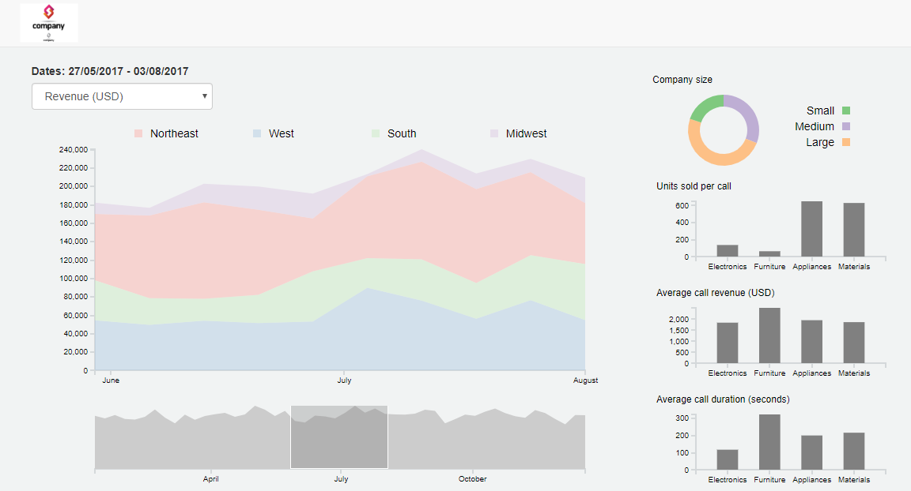

Assignment 4 - Visualizations and Multiple Views  
===

# Overview

This dashboard is for a company that sells different kinds of wholesale goods to other companies. The sales team is split between four different regions, and the objective is to compare stats between them. The dashboard helps track the performance of the sales team, and to understand how call duration, revenue per call and the number of units sold changes throughout the year.

## Dataset

The dataset is obtained from one of the assignment projects for a course on Udemy: 'Mastering data visualization in D3.js'. The file contains the information about every sales call that was completed by each of the sales team in the year 2017.

Link: [Corporate Performance dashboard]()

# Dashboard

The dashboard has 3 types of visualizations: Stacked Area chart, Donut chart, and Bar chart. At any point, the user can select one of three metrics to view on the dashboard: the Revenue in USD, the Call time and the Units sold.

The stacked area chart shows the monthly variation of the selected metric, with the four different areas representing the four regions: Northeast, West, South and Midwest.

The donut chart shows the percentage distribution of the metric across small, medium and large companies who made the sales call.

The 3 bar charts show the Units sold per call, the Average call revenue, and the Average call duration with respect to the type of goods sold: Electronics, Furniture, Appliances and other Materials.

In addition to the above visualizations, the dashboard also has a timeline which controls the range of data to be visualized. The user can drag the mouse across the timeline to select any date range he/she wishes to see, and all the above visualizations will automatically update accordingly. On clicking outside the selected date range, the filter is reset, and the user can proceed to select a new filter.

Legends have also been included for the stacked area chart and the donut chart to support and better understand the visualizations.

## Design Achievements

1. Better organized the visualizations on the screen, with the barcharts and the donut chart on one side since they dont require as much space as the stacked area chart, which needs space to adequately show the whole year range. The timeline is also nicely aligned with the time axis of the stacked area chart.

2. The colors used are quite distinct from each other, to better differentiate the categories.

3. The date range displayed on the top of the screen updates as per the selection for the user to accurately understand the range he/she has selected.

## Technical Achievements

1. Use of brush in d3 to make a visualization interactive.

2. The axes of the stacked area chart and the bar chart dynamically update according to the data available in the selected date range.

3. Use of d3 bootstrap to better segregate and organize the charts.

## References

Udemy's course: 'Mastering data visualization in D3.js'

http://bl.ocks.org/mattykuch/40ba19de703632ea2afbbc5156b9471f

http://bl.ocks.org/dukevis/6768900
