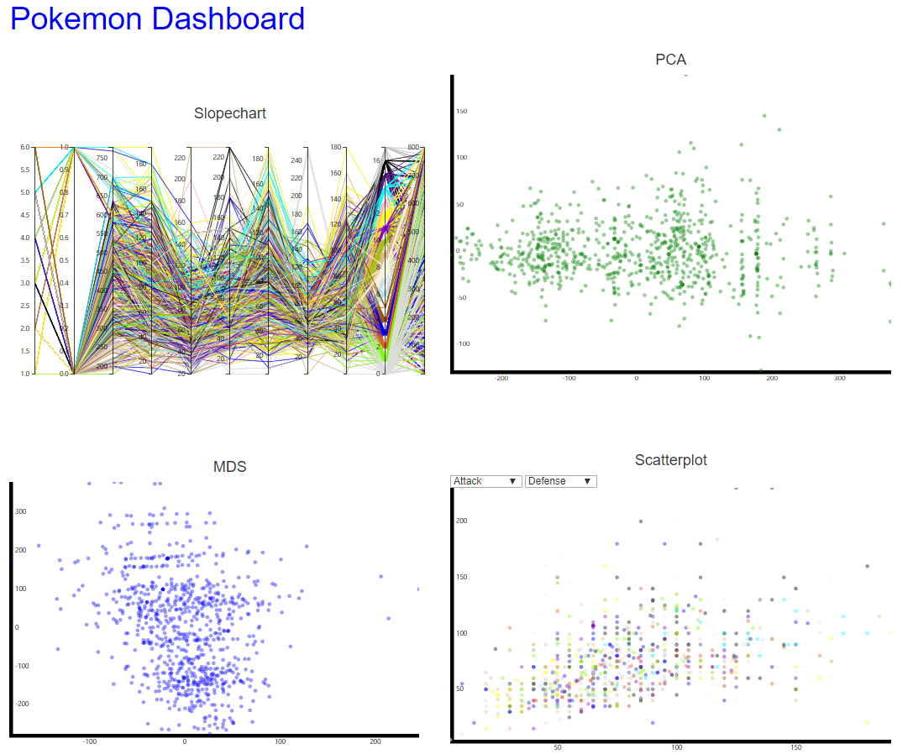
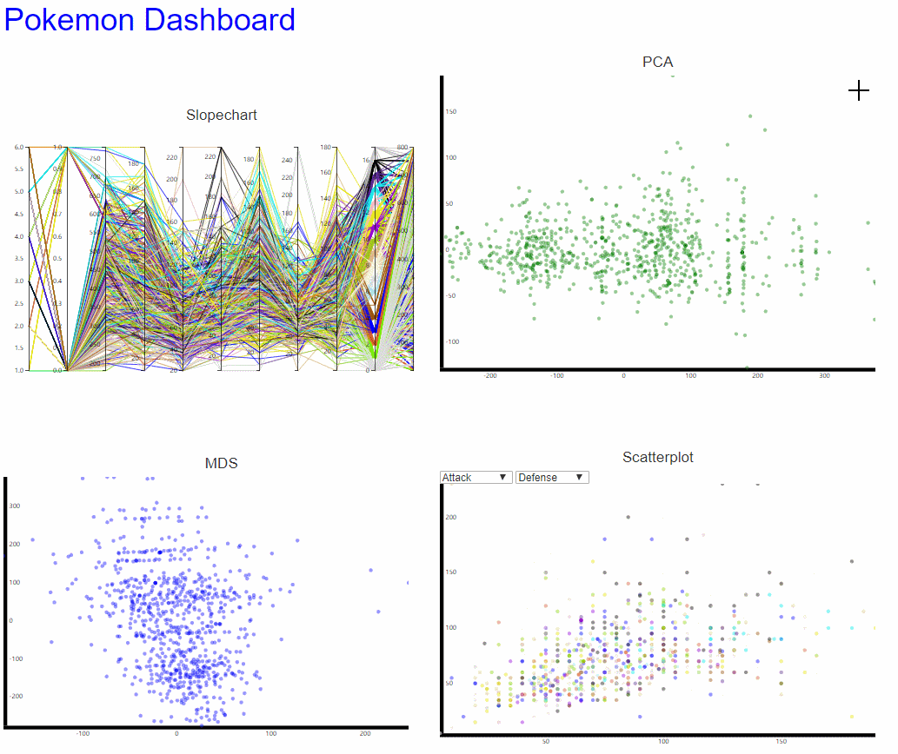
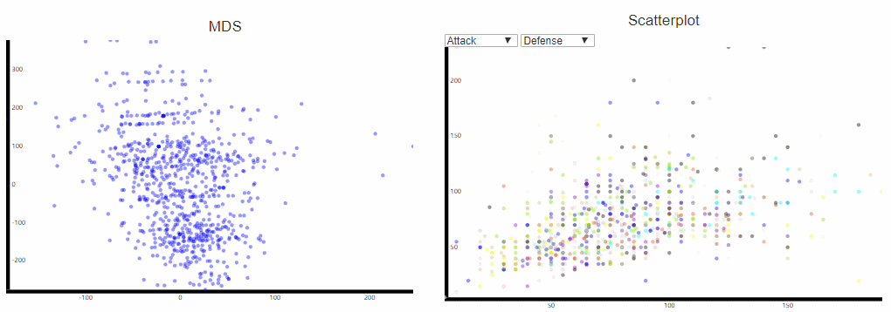

Assignment 4 - Visualizations and Multiple Views
===

Link: https://eva1721.github.io/04-MultipleViews/a4.html

Data: https://www.kaggle.com/abcsds/pokemon

I download the dataset for all pokemon from kaggle, It contains many data for each pokemon, like HP, attack, defense and speed. Then I use four plot to make this assignment.

Views:
---

The slopo chart each line stand by a data for each pokemon, From left to right is Generation, Legendary, Total, Sp.Atk, Sp.Def, Defence, Attack, HP, Speed, Type and their Global id. You can choose each part of every line and it will show what pokemon you choose in other plot.

For other plot, you can select a box and it will change in other plot, too.

