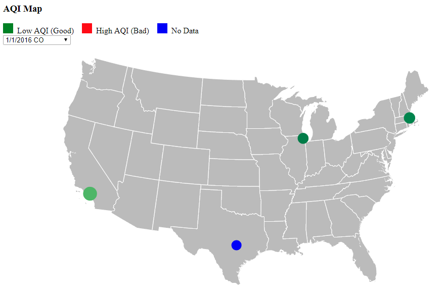
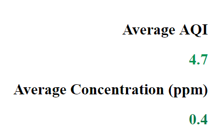
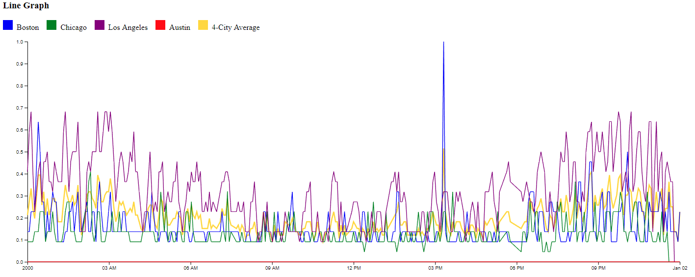
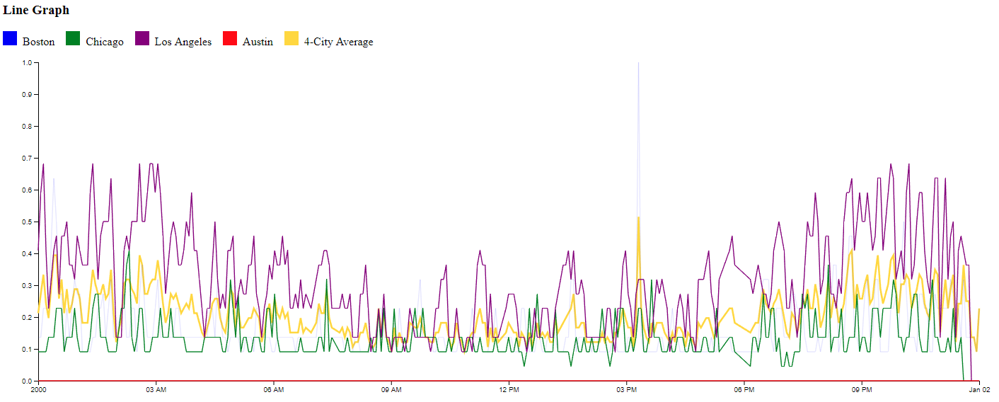

# Overview

The goal of my visualization is to give some analysis of air quality data in Boston, Chicago, LA, and Austin throughout the year of 2016. The dataset includes Air Quality Index (AQI), ppm or ppb measurements, and 4 different pollutants for each city for each date. 

# Visualizations

## Map

The map shows a display of the 4 cities with the AQI data displayed as a circle for the date and pollutant chosen. The circles are double-encoded by size and a Green-Yellow-Red colorscale, and placed with the latitude and longitude data. Hovering over the circles will display a tooltip giving the city name and the exact AQI number for that day. Clicking a city's circle will transition the line chart as explained below.

## Text Displays

The text display gives a display of the average AQI and the average concentration of pollutants for the given day. The text will transition with each selection from the dropdown menu. The text is again encoded with the Green-Yellow-Red colorscale.

## Line Chart

The line chart gives the average AQI for each of the 4 cities and the combined average over 2016 for the pollutant chosen by the dropdown menu. Each of the cities can be toggled on and off by clicking that respective city on the map. 

# Details

## Known Bugs

There are a few issues that I couldn't fix no matter what I tried.

1) The x-axis, while displaying the data correctly, will not correctly display the dates along the axis. d3 is interpreting my dates as a 24-hour day instead of a year, even though I added in a date parse function. This does not affect the readout of the data however.
2) Likewise, the line chart will not remove the previous lines from the last chosen date for some reason. I've tried selecting by element type, class, and id, but nothing will do the trick. The only solution I found was to select all paths from the svg element, but this deletes the axes and isn't a suitable solution.

## Design Achievements

1) I was able to correctly space my map, text displays, and line chart so that the readouts display to the right of the map as intended, and each graph has its respective legend right above it.

2) I included a d3 legend for both my map and my line chart. 

3) I included a floating tooltip so that users can see the exact measurements displayed by the circles on the line chart.

4) My text readouts will change from ppm/ppb accordingly on the fly depending on the pollutant.

## Technical Achievements

1) My map and text displays both will catch dates with no data for particular cities and color them blue instead of just assigning them a value of 0.

2) Accordingly, my average calculations for the AQI and ppm/ppb do not include missing entries in their average, and will instead dynamically include or disclude them from the dataset in the map and text readouts.

3) My text display includes tween transitions for both the AQI and concentration. In addition, I was able to format the floating point numbers to only display 3 digits instead of spitting out the entire float data type during the transition for easier reading using a d3 number format. My tween animation also includes the color scale and will transition accordingly. 

# References

https://bl.ocks.org/mbostock/5872848

https://bl.ocks.org/d3noob/4db972df5d7efc7d611255d1cc6f3c4f