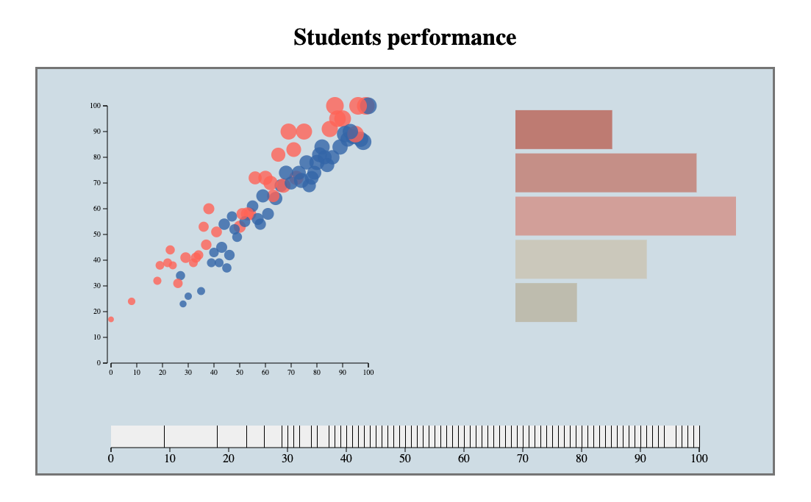
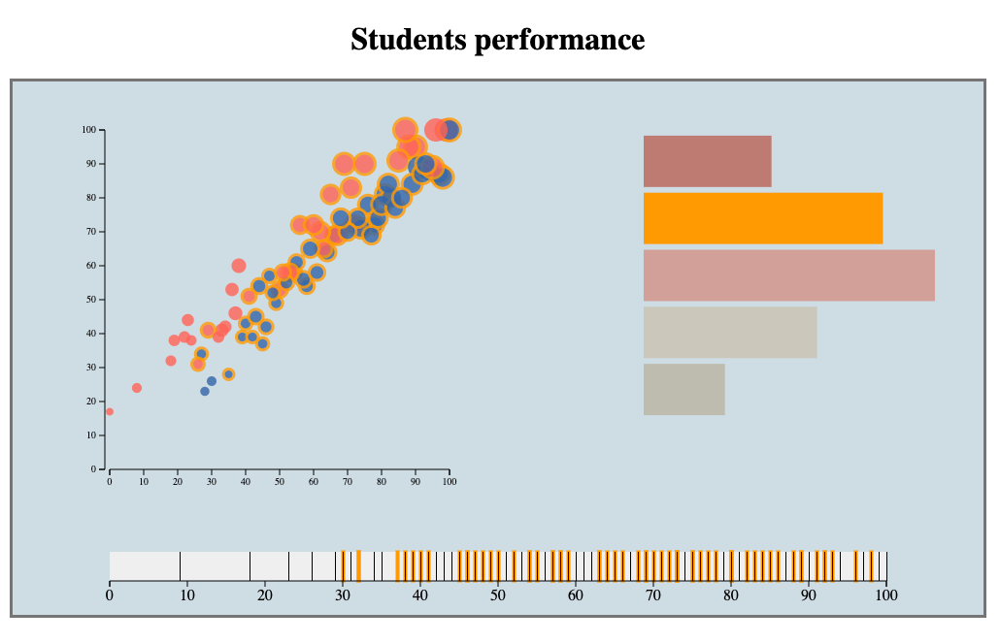
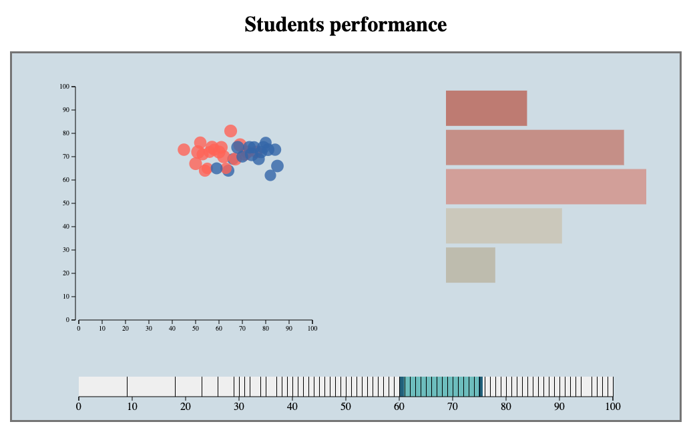

Assignment 4 - Visualizations and Multiple Views  
===

visualization link: https://mkliu1013.github.io/04-MultipleViews/

Students performance dataset reflects anonymous students test scores including their race, parent education level. The multiple views linked the different score, race, average score together to reflect their performance. The x axis of scatter plot is math score, the y axis of scatter plot is reading score, color mapping on gender, and size mapping on writing score. The histogram reflects their race group, it's also anonymous and grouped by A,B,C,D,E. The brush distribute according to their average score. 

Linked Views:

Brush Views:

Technical Attempted
---
1. Using d3.dispatch to trigger events.
2. Using brush to interactive with data by dragging the mouse.

Design Attempted
---
1. Color Scheme:

2. Layout Design for better viewing

Reference:
---
http://bl.ocks.org/dukevis/6768900
