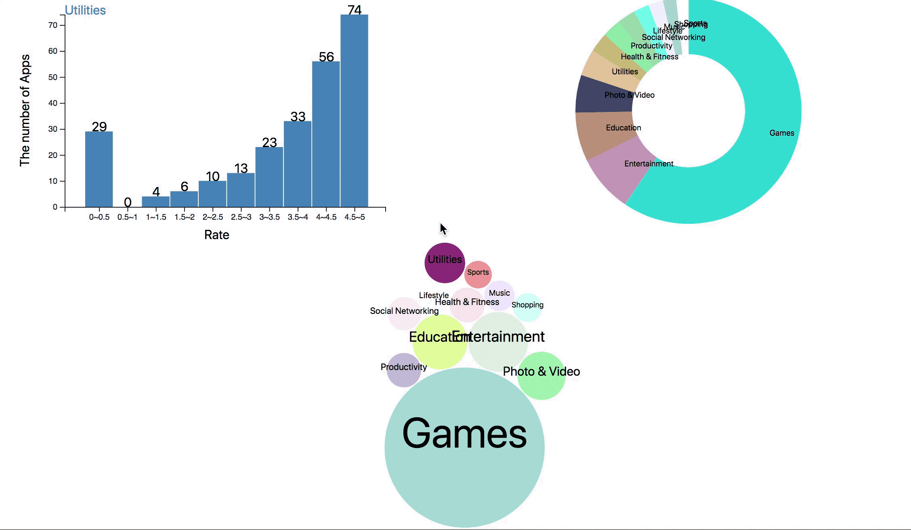

Assignment 4 - Visualizations and Multiple Views  
===

https://dengninghe.github.io/04-MultipleViews/
This is a visualization based on Mobile App Statistics available on Kaggle.com.
https://www.kaggle.com/ramamet4/app-store-apple-data-set-10k-apps

Descriptions
---
Mobile app analytics is a great way to understand the existing strategy to drive growth and retention of future user. In this visualization: 
The bar chart illustrate the ratings of each app in a different category. 
The donut chart shows the quality of each genre in a 100% scale. 
The bubble chart provides much detail information and an intuitive view of app market shares. 

ScreenShot
---

Technical Achievements
---
 - Coded the visualization using multiple event triggers. 
 - Regenerated the y-axis in the bar chart every time when category change. 
 - Created labels for each category on the bubble chart. 
 - Sorted the data into different rating ranges.
 - Created a same-sized bar chart based on the sum number of each category and add number label on each bar. 

Design Achievements
---
- Rendered the color of the model using color Array2, which is the relatively clean color scheme. 
- Positioned the graphs in an appropriate layout, allowing the user to trace the interactions without extra mouse movement.
- Changed the label size on the bubble chart in order to show all the information clearly. 
- Animated the transition process. The user can catch the interaction with smoothly changed views. 
- Added the sum number on the top of each bar when view changed. 

