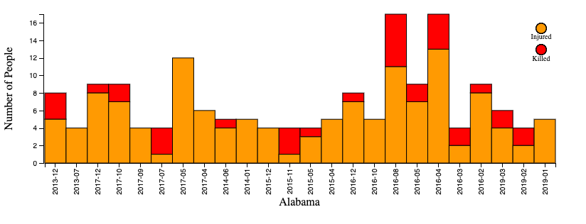
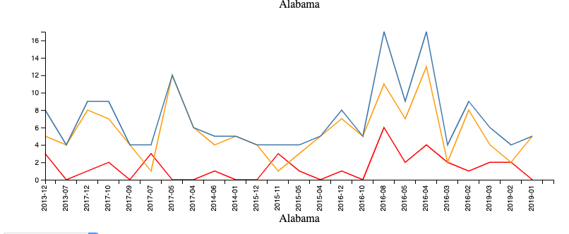

Assignment 4 - Visualizations and Multiple Views  
===
Github Pages Link: https://rmabualhaija.github.io/04-MultipleViews/ 

Visualization
---

For this assignment I used a dataset that gives all the mass shootings from 2013- March of 2019 I have a visualization that is a bar chart that is made of two parts, a red portion that shows the number of people killed in the mass shooting, and an orange bar that shows the number of people injured. Aditionally there is a line chart that has three lines one for people killed (red) one for people injured (orange) and one for the total number of people affected (blue). In both of these visualizations each bar represents one month. Aditionally the data is filtered by state, there is a dropdown menu that will update both the bar and the line chart with whatever state you want to see statistics for.

Technical Achievments
--- 
- Script to combine and format data appropriately for visualization 
- Linked visualizations that change on both on interaction
- Used nest and filter commands to process data in an way that was different than what was given in the data set. 

Design Achievments
---
- Drop down menu for ease of selection of state
- Tooltip on mouseover to make number of people more clear

