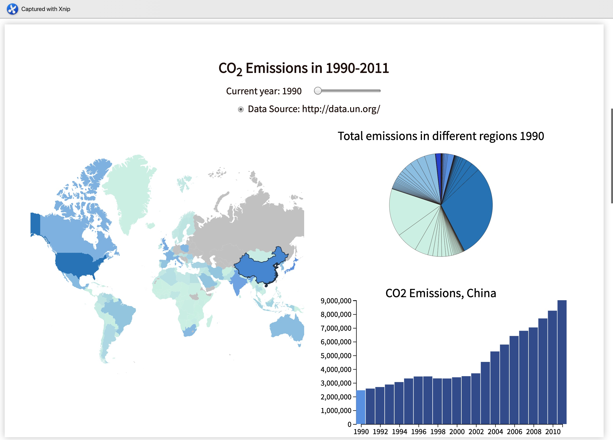

Assignment 4 - Visualizations and Multiple Views  
===

Link: 
https://leixxli.github.io/04-MultipleViews/

Overview
---

The data I got is from http://data.un.org/. In this assignment, I have built a dashboard including three kinds of plots, maps, pie chart and bar chart, to visulize the emissions of carbon dioxide in 1990 to 2011 through the world. The whole dashboard is viewed as follows:

The map uses color to represent the seriousness of carbon dioxide emissions. Color will change as different time periods. The pie chart shows the total emissions in different region. The bar chart shows the emissions in different year and in different region. Emissions in measured by thousand metric tons in this plot. 

The linked views show as follows: 
1. Once selecting different year in the processing bar, map data will show the overall situation. You will notice the change in color. Pie chart will show the concrete data in that year, and bar chart will show the emissions in selected region. Emissions in selected year will mark as a different color. 

2. Once select the specific region in map, the bar chart will change correspindingly with marking the selected year. Besides that, the tooltip will show the data in select information. 

Technical achievements
---
1. Implemented tooltips in three plots.
2. Included three kinds of plots. 
3. Once selecting different year, map,pie chart and bar chart will change. 
4. Selecting different region in map, the bar chart shows the emissions in this region through the time. 

Design achievements
---
1. Adding color palette to represnt the seriousness of carbon dioxide in the map and pie chart.
2. Including a processing bar to select, in this way, users can easily get used to fetch the information.  

Reference 
---
1. I started with this example: http://bl.ocks.org/mattykuch/40ba19de703632ea2afbbc5156b9471f , http://bl.ocks.org/NPashaP/96447623ef4d342ee09b 
2. tooltips: http://bl.ocks.org/anonymous/64f9c70bd629810bee67392f6224d414
3. udemy courses - Mastering data visualization in D3.js - map and networks/file structures and linke views. I learned how to use TopoJSON file for map data (unpkg.com)and update the events to link different views.

