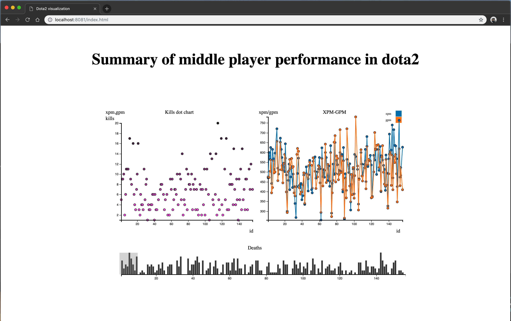

Assignment 4 - Visualizations and Multiple Views
===
Topic: Summary of middle player performance in dota2
===

Data:
---
https://www.kaggle.com/siegmundwang/dota2

Link:
---

Overview:
---
As we all know, the middle position is the most important position in the dota2 match, so the performance of the middle players directly affects the outcome of the game. Therefore, we want to know what kind of performance of middle players have played in the recent match, and what level we should achieve.

Meaning of data column:
---
kda: (kill+assist)/death,
gpm: gold per minute,
xpm: experience per minute.

Description:
---
-The bottom bar chart shows the number of deaths of each player in the game.
-The scatter plot shows the number of players killed in each game. 
-The line chart shows the xpm and gpm of each player.

Views:
---
Link view:

toolip view:

Scatter plot:

Line plot:

Bar chart:

Technical Achievement Description
----
- Using Python(pandas) to clear data and export csv files.
- Toolip used to build scatter plot and line chart.
- EnterUpdateExit usd to build scatter plot and line chart.
- Can use brushing on the bar chart.
- In scatter plot, dots color changes according to kills number.
- When mouse over scatter plot and line chart, the label will show the detail.
- y axis will change due to the data we choose.

Design Achievement Description
----
- Three plots are used different color.
- In scatter plot, dots color changes according to kills number from light to dark.
- When using burshing choose some data, bar chart will change color to orange that more obviously.
- Line plot has two lines that are different color. Every point on the line will be slightly larger.
- Web has title and head. Title font size is moderate. 
- The bar chart is at the bottom and is very long, so that when the amount of data is large, it will not appear very crowded. The upper two images are evenly distributed, and the page is neat and orderly.
