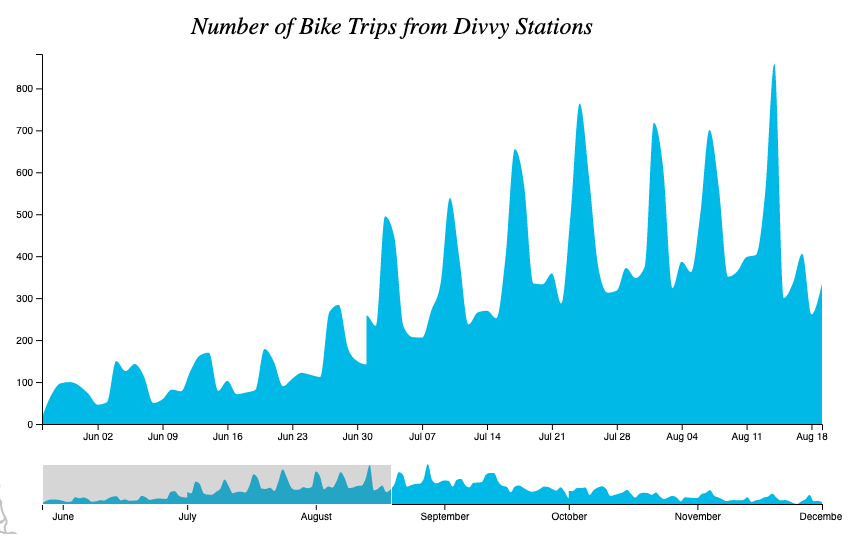

Assignment 4 - Visualizations and Multiple Views  
===
#### Sam Longenbach
##### Visualization: https://longenbach.github.io/04-MultipleViews/indexv2.html
##### Code: https://github.com/longenbach/04-MultipleViews/blob/master/indexv2.html

## Overall Visualization:


Above is a screenshot of the mutiple views visulzation I created. Divvy is a bike sharing platform in Chicago started in 2013. Users can check out a bike form one station and return it to another station for a small fee. I wanted to create a basic visulation to show the number of trips taken from different subsets of stations over time. All Divvy's trip and station data is public and avaible on their [website](https://www.divvybikes.com/system-data). For this visulzation I focused on 2013 stations and trips since working with all of the trip data would be quite large ~2.5gb.  

## Map Chart:


From [OpenStreetMap](https://www.openstreetmap.org/#map=11/41.8370/-87.6742) using the [Overpass API](https://overpass-turbo.eu/) I was able to extract the GeoJSON file containing all bike paths in Chicago. The image above on the right is the selection of the various Chicago bike paths after running the following query below on Overpass. 

```Java 
[out:json];
(
  // get cycle route relatoins
  relation[route=bicycle]({{bbox}});
  // get cycleways
  way[highway=cycleway]({{bbox}});
  way[highway=path][bicycle=designated]({{bbox}});
);

out body;
>;
out skel qt;
```
The image above on the left is the map of Chicago bike paths [(file: Chicago_BikePaths.geojson)](https://github.com/longenbach/04-MultipleViews/blob/master/Chicago_BikePaths.geojson) with the 2013 Divvy stations [(file:Divvy_Stations_2013.csv)](https://github.com/longenbach/04-MultipleViews/blob/master/Divvy_Stations_2013.csv) plotted on top. For the interactive compement you can brush over and select which stations you would like to see the number of trips over time displayed by the area charts. The selected stations appear in orange and their respetice names appear at the bottom of the graphic. One feature I would have liked to add but did not have time is a map zoom feature. It is alittle busy in downtown Chicago and selecting partucilar stastions is diffcult.   

## Area Charts:



Once a brush selection is made in the map portion of the visulazation, the number of trips stored in 2013 [(file: Divvy_Trips_2013_Processed.csv)](https://github.com/longenbach/04-MultipleViews/blob/master/Divvy_Trips_2013_Processed.csv) is filtered by the brush selected station ids. The aggreagted number of trips over time is what is then shown in the following area charts above. Both area charts are interactive with brush and zoom interaction. On the larger "focused" area chart you can click to zoom and drag to focus on different periods in time. The smaller "context" area chart you can slide/expand the brush to change the focused area as well. If you chnage the "focused" area chart, the "context" area chart will change and vice versa. Both charts allow you to see the severaity of seasonality and rush hour affact after selecting different stations.         

## Technical & Design Achievement Highlights:

- Building off Week 10 reflection, leanred more about OpenStreetMap and used it to plot bike path data. 
- Wrangled Divvy data in Python notebook to make this visulzation possible. 
- Implemeted some of my first brush interactions in D3.
